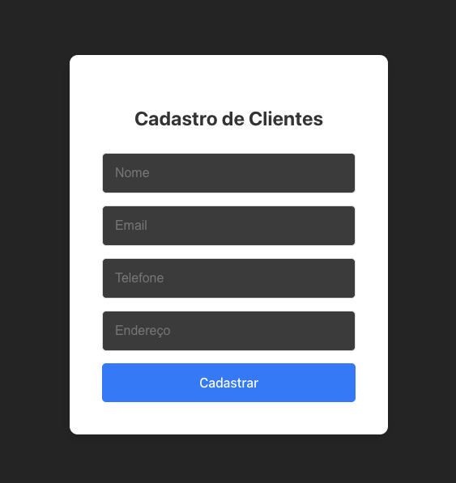

# Primeira Atividade Prática - Avaliativa - AP1 - 0.5 pontos

# Projeto - Formulario Não Funcional

Ideia era apresentar um formulário estruturado através de componentes. Efetuado inicialmente a codificação do component Form onde foi utilizado o component FormItem complementando com css.

Resultado:

